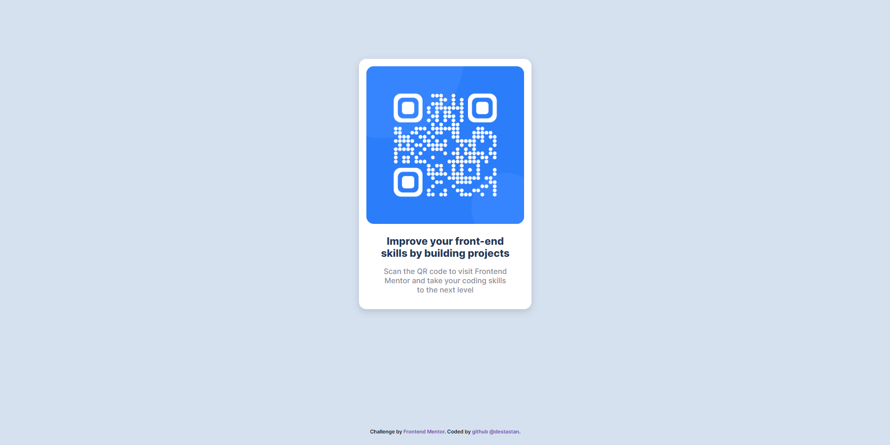

# Frontend Mentor - QR code component

This is a solution to the [QR code component challenge on Frontend Mentor](https://destastan.github.io/QR-code-component-solution/).

## Table of contents

- [Overview](#overview)
  - [Screenshot](#screenshot)
  - [Links](#links)
- [My process](#my-process)
  - [Built with](#built-with)
  - [What I learned](#what-i-learned)
- [Author](#author)
- [Acknowledgments](#acknowledgments)

## Welcome! 👋

This is my first challenge submission for the Frontend Mentor challenge.

## Overview

### Screenshot 

### Links
- 
- 

## My Process

### Built With

- Semantic HTML5 markup
- CSS custom properties
- Flexbox

### What I learned

In this project, I learned how to create a responsive layout using Flexbox. I also learned how to use Styled Components to add custom styles to my components.

### Author

- Website - [Destan Tastan](https://github.com/destastan)
- Twitter - [@destastan](https://twitter.com/destastan)

## Acknowledgments

I want to thank the Frontend Mentor community for providing such a great platform to practice and improve my coding skills.